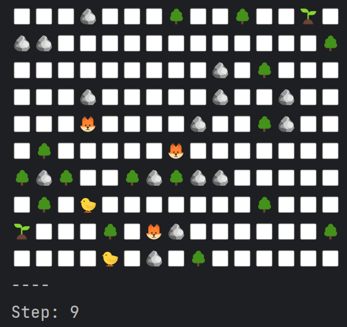

---
### Навигация:
[1. Описание](#descriptiption)  
[2. Технологии](#tech)  
[3. Быстрый старт](#start)   
[4. Взаимодействие с приложением](#use)  
[5. Автор проекта](#author)

---

### Описание:
Суть проекта - пошаговая симуляция 2D мира, населённого травоядными и хищниками. Кроме существ, мир содержит ресурсы (траву), которыми питаются травоядные, и статичные объекты, с которыми нельзя взаимодействовать - они просто занимают место.

Основная цель проекта - отточить навыки в ООП, реализовать алгоритм поиска пути.

Более подробное техническое задание можно найти [ТУТ](https://zhukovsd.github.io/java-backend-learning-course/Projects/Simulation/).

---

### Технологии:

  
- Для поиска пути используется: упрощенный алгоритм A*.  
В качестве опорного расстояния для формирования эвристической функции используется [расстояние Чебышёва](https://www.translatorscafe.com/unit-converter/ru-RU/calculator/two-points-distance/?D=2&amp;x1=3&amp;y1=3.5&amp;x2=-5.1&amp;y2=-5.2#chebyshev-distance).

---

### Быстрый старт:

1. Клонируйте репозиторий:  
   `git clone https://github.com/grishuchkov/study-simulation-project.git`

2. Для сборки проекта используйте стандартную команду: `gradle clean build`.
3. Это создаст `simulation-project-1.0-SNAPSHOT.jar` в каталоге `build/libs`, теперь приложение доступно для запуска с использованием `java -jar simulation-project-1.0-SNAPSHOT.jar`. Командная строка должна находиться в директории `build/libs`.

4. Также приложение можно запустить и через IDE.

(<a href="#readme-top">↑ Наверх</a>)

---

### Взаимодействие с приложением:

При запуске симуляции вас встретит меню с инструкцией.  
- При вводе в консоль `S` – начинается процесс симуляции, также эта команда используется для снятия симуляции с паузы.  
- При вводе `P` – ставится пауза.
- При вводе `N` –    симулируется один шаг.

Когда на карте не остается травоядных, симуляция считается завершенной.

Экран симуляции:   

(<a href="#readme-top">↑ Наверх</a>)

---

### Автор проекта:  [Grishuchkov Danila](https://github.com/grishuchkov)

#### Данный репозиторий является реализацией второго учебного проекта из курса [Java Backend Learning](https://zhukovsd.github.io/java-backend-learning-course/)

---
